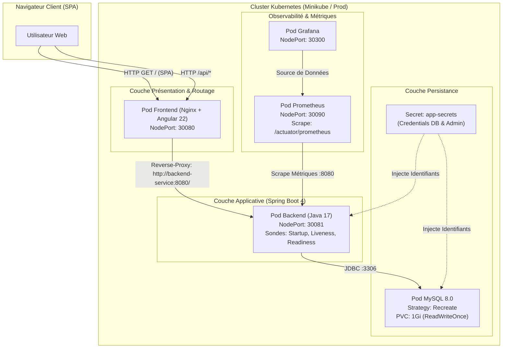
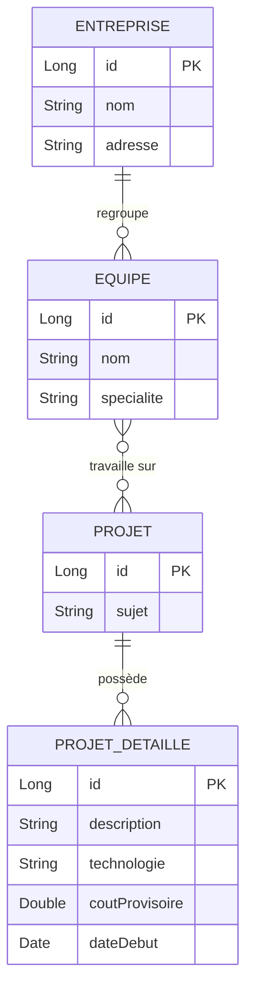
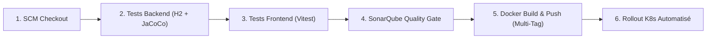

# DevOps-AppGestionDesProjets

Plateforme complète de **Gestion de Projets d'Entreprise** conçue selon les standards **Full-Stack, Cloud-Native et DevSecOps**.  
Ce projet intègre un backend **Spring Boot**, un frontend **Angular (Nginx SPA)**, un pipeline d'intégration/livraison continue **Jenkins**, une orchestration conteneurisée sous **Kubernetes**, et une stack d'observabilité avec **Prometheus & Grafana**.

---

## 🏛️ Architecture Globale Cloud-Native



---

## 🛠️ Stack Technologique

| Domaine | Technologie | Rôle & Particularités |
|---|---|---|
| **Backend** | Spring Boot 4.1.0 (Java 17) | API REST, Spring Data JPA, Lombok, Actuator, Micrometer Prometheus |
| **Frontend** | Angular 22 (Node 22 / TypeScript 6) | Standalone Components, Reactive Signals, HttpClient |
| **Reverse Proxy** | Nginx Alpine | Hébergement SPA, routage d'API `/api/` sans CORS, compression Gzip |
| **Base de Données** | MySQL 8.0 & H2 | Persistance de production (MySQL) et tests hermétiques en mémoire (H2) |
| **Conteneurisation** | Docker (Multi-stage builds) | Images légères basées sur Alpine (Temurin JRE 17 et Nginx Alpine) |
| **Orchestration** | Kubernetes 1.30+ / Minikube | Deployments, Services (NodePort / ClusterIP), PVC, Secrets, Probes |
| **CI / CD** | Jenkins Pipeline Déclaratif | 6 étapes automatisées (Checkout, Tests, SonarQube, Build Docker, Rollout K8s) |
| **Qualité de Code** | SonarQube & JaCoCo | Analyse statique et rapport de couverture de code automatisé |
| **Observabilité** | Prometheus & Grafana | Collecte des métriques JVM/Système et tableaux de bord de surveillance |

---

## 🧩 Modèle de Données

L'application gère l'écosystème organisationnel suivant :



---

## 🧪 Stratégie de Tests Automatisés

Le projet respecte les principes de tests **hermétiques et isolés** (aucune dépendance à un MySQL externe pour valider le code) :

### 1. Tests Backend (Spring Boot + Mockito + H2 + JaCoCo)
- **Base de test en mémoire** : [`src/test/resources/application.properties`](file:///home/jackal/Documents/DEVOPS/DevOps-AppGestionDesProjets/backend/src/test/resources/application.properties) charge une base H2 en mode de compatibilité MySQL.
- **Tests unitaires métier** : [`EntrepriseServiceTest.java`](file:///home/jackal/Documents/DEVOPS/DevOps-AppGestionDesProjets/backend/src/test/java/tn/esprit/backend/service/EntrepriseServiceTest.java) valide l'intégralité du cycle de vie CRUD via Mockito.
- **Rapport de couverture** : Le plugin JaCoCo génère automatiquement :
  - `backend/target/site/jacoco/jacoco.xml` (utilisé par SonarQube).
  - `backend/target/site/jacoco/index.html` (rapport visuel).

```bash
cd backend
mvn clean test
```

### 2. Tests Frontend (Angular + Vitest)
- Tests de composants et de routage exécutés sans navigateur via Vitest et jsdom :

```bash
cd frontend
npm test -- --watch=false
```

---

## 🚀 Guide de Déploiement

### Option A : Déploiement sur Kubernetes (Minikube / Cluster)

#### 1. Appliquer les manifestes dans l'ordre de dépendance
```bash
# 1. Secrets applicatifs (mots de passe chiffrés en base64)
kubectl apply -f k8s/secret.yaml

# 2. Base de données MySQL (avec PVC et stratégie Recreate)
kubectl apply -f k8s/mysql.yaml

# 3. Backend Spring Boot (avec sondes startup/liveness/readiness et quotas)
kubectl apply -f k8s/backend.yaml

# 4. Frontend Nginx (avec reverse-proxy d'API)
kubectl apply -f k8s/frontend.yaml

# 5. Monitoring & Observabilité
kubectl apply -f k8s/prometheus.yaml
kubectl apply -f k8s/grafana.yaml
```

#### 2. Cartographie des Accès & Ports Kubernetes

| Service | Type | Port Cluster | NodePort Externe | URL d'Accès (Minikube IP : `192.168.49.2`) |
|---|---|---|---|---|
| **Frontend Web** | NodePort | 80 | `30080` | `http://<MINIKUBE_IP>:30080/` |
| **API Backend** | NodePort | 8080 | `30081` | `http://<MINIKUBE_IP>:30081/` |
| **Actuator Santé** | Interne / NodePort | 8080 | `30081` | `http://<MINIKUBE_IP>:30081/actuator/health` |
| **Prometheus** | NodePort | 9090 | `30090` | `http://<MINIKUBE_IP>:30090/` |
| **Grafana** | NodePort | 3000 | `30300` | `http://<MINIKUBE_IP>:30300/` *(admin/admin)* |

---

### Option B : Déploiement avec Docker Compose

```bash
# 1. Créer le réseau partagé (requis par la configuration externe)
docker network create devops-network

# 2. Démarrer MySQL (si conteneur externe) ou lancer la stack
docker compose up --build -d
```

L'application frontend est accessible sur **http://localhost:4200** et dialogue de manière transparente avec le backend sur l'alias réseau `backend-service`.

---

### Option C : Lancement Local (Développement)

#### 1. Backend Spring Boot
```bash
cd backend
mvn spring-boot:run
```
> Le backend écoute sur `http://localhost:8080`.

#### 2. Frontend Angular
```bash
cd frontend
npm install
ng serve
```
> L'application s'ouvre sur `http://localhost:4200` et bascule automatiquement sur l'environnement de développement ciblant l'API locale.

---

## 🔄 Pipeline CI/CD Jenkins ([`Jenkinsfile`](file:///home/jackal/Documents/DEVOPS/DevOps-AppGestionDesProjets/Jenkinsfile))

Le pipeline déclaratif orchestre les étapes de livraison continue de bout en bout :



1. **Stage 1 : Checkout SCM** : Récupération automatique de la branche active.
2. **Stage 2 : Test & Package Backend** : Exécution de `mvn clean test` (tests H2 + génération JaCoCo) suivi du packaging JAR.
3. **Stage 3 : Test Frontend** : Exécution des tests unitaires Angular via `npm test -- --watch=false`.
4. **Stage 4 : Analyse SonarQube** : Analyse statique avec transmission du rapport de couverture `target/site/jacoco/jacoco.xml`.
5. **Stage 5 : Docker Build & Push** : Construction multi-stage et push sécurisé vers Docker Hub avec double tag (`:${BUILD_TAG}` et `:latest`).
6. **Stage 6 : Deploy to Kubernetes** : Application des manifestes (`k8s/*.yaml`), redémarrage ordonné des pods et vérification du statut avec timeout (`kubectl rollout status`).

---

## 📊 Endpoints REST de l'Application

Toutes les routes d'API sont exposées à la racine du backend ou proxifiées via `/api/` par le frontend Nginx :

### Entreprises (`/api/entreprise`)
- `GET /api/entreprise/all` : Liste de toutes les entreprises
- `GET /api/entreprise/get/{id}` : Détails d'une entreprise
- `POST /api/entreprise/add` : Enregistrement d'une entreprise
- `PUT /api/entreprise/update` : Mise à jour d'une entreprise
- `DELETE /api/entreprise/delete/{id}` : Suppression d'une entreprise

### Équipes (`/api/equipe`)
- `GET /api/equipe/all` : Liste des équipes
- `POST /api/equipe/add` : Création d'une équipe
- `PUT /api/equipe/assign-entreprise/{equipeId}/{entrepriseId}` : Affectation à une entreprise
- `PUT /api/equipe/assign-projet/{equipeId}/{projetId}` : Affectation à un projet

### Projets (`/api/projet`)
- `GET /api/projet/all` : Liste des projets
- `POST /api/projet/add` : Création d'un projet

### Projets Détaillés (`/api/projet-detaille`)
- `GET /api/projet-detaille/all` : Liste des spécifications techniques et budgets
- `PUT /api/projet-detaille/assign-projet/{pdId}/{projetId}` : Liaison avec un projet existant

### Observabilité (`/actuator`)
- `GET /actuator/health` : État global de santé (`UP`, vérification DB MySQL, disque, sondes)
- `GET /actuator/health/liveness` : Sonde de vivacité Kubernetes
- `GET /actuator/health/readiness` : Sonde d'état prêt Kubernetes
- `GET /actuator/prometheus` : Métriques format Prometheus scrapées toutes les 15s